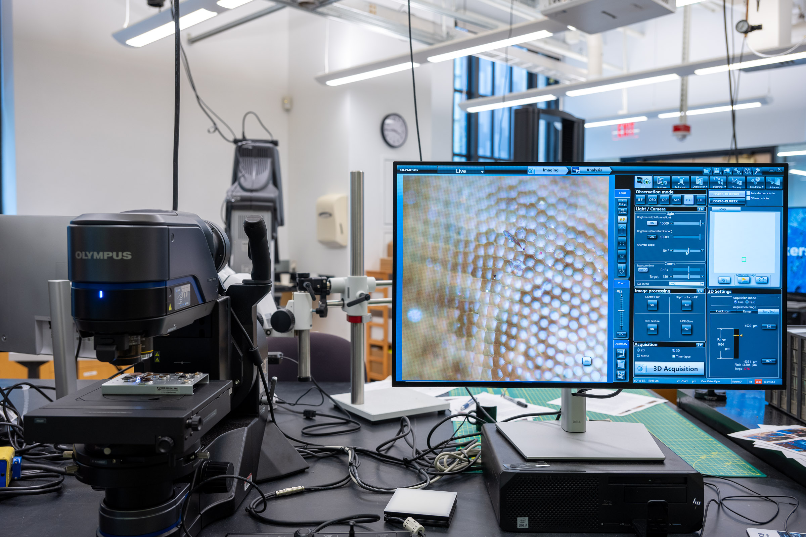

## Breakerspace Lab

The Breakerspace Lab is a growing suite of materials characterization instruments, located in 8-102A (accessed through the Breakerspace Lounge). In addition to the instruments, we have cameras, microphones, tripods, lighting, and other equipment that can be used to document projects.

**Hours:** The Breakerspace Lab is open 10 AM to 10 PM weekdays, and 12 PM to 5 PM weekends for trained users.

### Thermofisher Phenom XL SEM

The Phenom XL SEM (scanning electron microscope) has a large sample area, BSD and SED detectors, EDS, and is hugely popular.  

___

### Thermofisher Phenom Pure SEM 

The Phenom Pure can load a single sample, and BSD and SED detectors but no EDS. We have a temperature-controlled sample stage with a range of -25° C to 50° C, and a low-vacuum, charge dissipating stage.
___

### Olympus DSX-1000 Digital Optical Microscope

See images in full color at high magnifications, capture 3D data, and stitch together large images with this easy-to-use digital microscope offering six observation modes.  

___

### Panalytical Aeris Research XRD 

Use the XRD (X-ray diffractometer) to analyze properties such as phase composition, crystal structure, and orientation of solid samples.  

___

### Horiba Duetta Fluorescence and Absorbance Spectrometer

Duetta can be used as a fluorometer, as a UV-Vis-NIR spectrometer to measure absorbance, or as an instrument that measures true molecular fingerprints, which require the acquisition of fluorescence and absorbance, correcting for IFE in real time.  

___

### Nicolet iS5 FTIR Spectrometer

Fourier-transform infrared spectroscopy (FTIR) provides an infrared spectrum of absorption or transmission of a solid, liquid, or gas, for identification, primarily, of organic or polymeric materials.

___

### Instron 68TM-50 Universal Testing System

Our test frame is equipped with 50 kN and 5 kN load cells, with fixtures for tensile, compression, and flexure testing.

___

### Instron Model 9050 Pendulum Impact System

Perform IZOD testing at up to 50 joules on our impact testing system.

___

### Horiba XploRA Confocal Raman Microscope

Collect Raman spectra to idenfity compounds and observe other characteristics of a range of materials on our instrument, which is configured with 532nm, 638nm and 785nm lasers, and 600, 1200, 1800, and 2400 gr/mm gratings. 

___

### Technoorg-Linda SEMPrep 2 Broad Beam Ion Mill

Our ion mill enables damage free sample prep for SEM imaging. It is equipped with two ion guns: a high-energy gun with a 2-16 keV range, and a low-energy gun with a 0.1-2 keV range. We have sample holders for polishing, and for 30° and 90° slope cutting, with a handy microscope to help with sample alignment. Our LN2 cooling option allows milling of heat-sensitive samples with good temperature control.

___

### Innovatest Nemesis 5100G2 Hardness Tester

This hardness tester has a 9-position turret to automatically swith between indenters and objectives, and uses a load cell to measure applied load. It also has an XY stage, and can be programmed to run test patterns. The Breakerspace system is equipped with indenters for Vickers, Rockwell, and Brinell, and can run a range of scales.

___

### Microtrac Sync Particle Size Analyser

This instrument gives particle size distribution data for dry powder samples with particles between 0.01 and 4,000 microns using laser diffraction.

