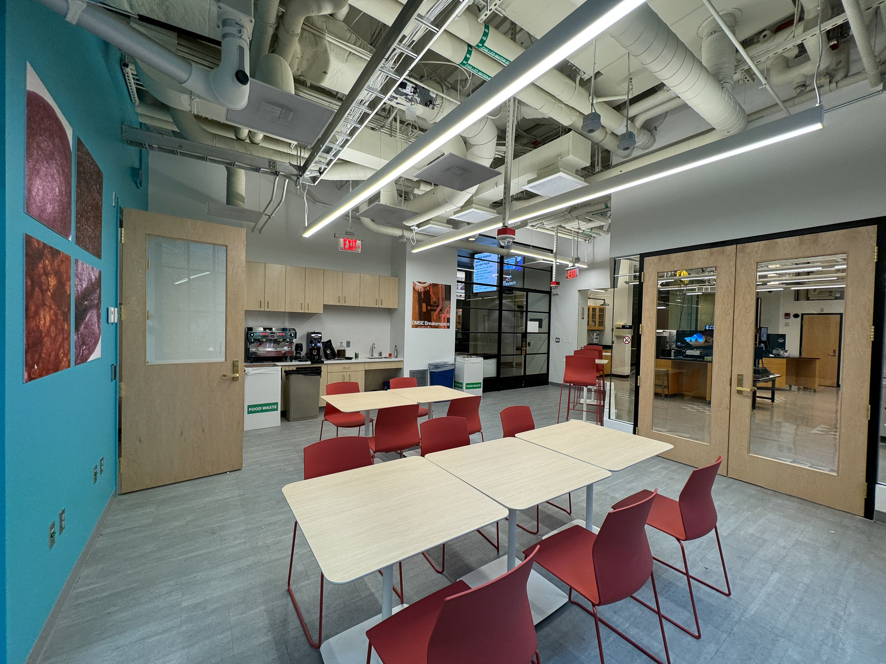
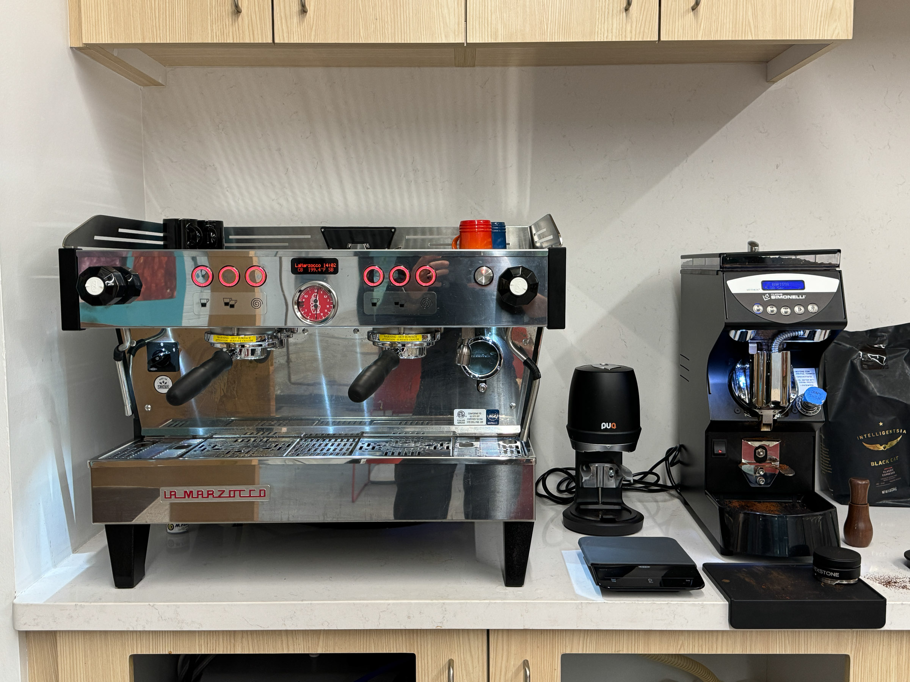
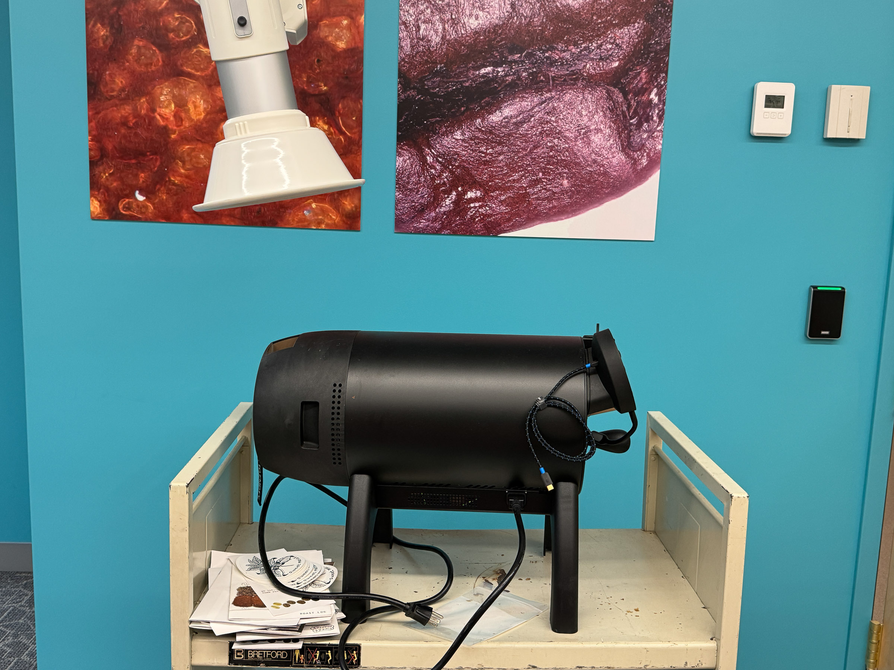

## Breakerspace Lounge

Outfitted with a beautiful La Marzocco Linea PB espresso machine, a Nuovo Simonelli Mythos grinder, PuqPress automatic tamper, and more, the Breakerspace Lounge is the source of the best espresso on campus.

**Hours:** The Breakerspace Lounge is open 8 AM to midnight, seven days/week once you request access and agree to lounge policies. 

**Request lounge access:** The Breakerspace Lounge is open to all MIT undergraduates from 8 AM to midnight, daily. In order to gain tap access to the lab, please fill out [this form](https://forms.gle/1pd59bjGXiPnehDL9). Tap access is usually granted within two business days. 

**Espresso:** Once you are granted access, you will be able to make espresso during open hours. Remember to bring your own mug!

**Roasting:** Inquire about joining the coffee roasting club to learn experiment with how roasting impacts coffee characteristics and roast coffee using our Aillio Bullet R1 V2 roaster.

