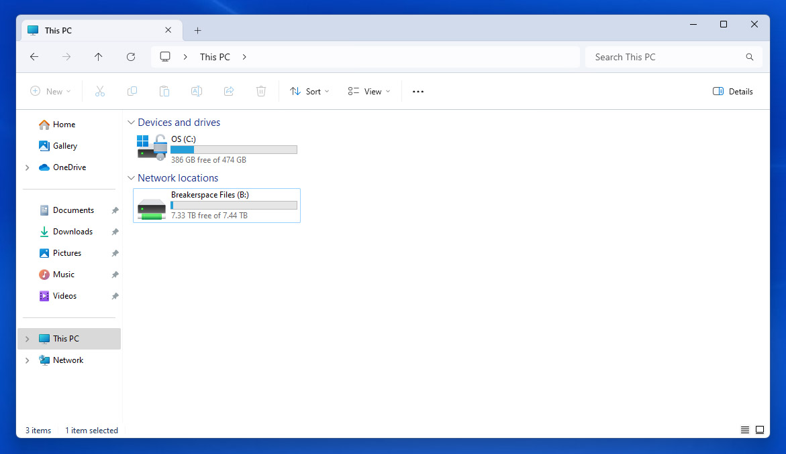

## Breakerspace Resources

Here are the digital resources we have set up to allow for easy file sharing and transfer, and to ask questions and discuss projects or instruments.

### Workstation access

The workstations in the Breakerspace are on the [MIT WIN domain](https://ist.mit.edu/winmitedu), with access being managed via [Moira group lists](https://groups.mit.edu/webmoira/). After you are trained, you should be added to the relevant group (ie. dmse-brkrspc-sem for the SEMs), and once this process is completed you should be able to log on to the relevant workstation with your MIT Kerberos ID and password. If you have completed training and believe you should have access, but cannot log on, please find one of us or contact us: [dmse-breakerspace@mit.edu](mailto:dmse-breakerspace@mit.edu).

### File management

When you log in to one of our workstations, you will see a shared network drive mapped in 'My Computer' called 'Breakerspace Files', usually mapped to drive letter (I:).

{:target="_blank"}

This shared drive is hosted on a file server in the Breakerspace, and is also the Dropbox Team folder for the 'DMSE Breakerspace' Dropbox Team. Please note that files saved here will be accessible to other users logged in to any Breakerspace workstation, and will also be accessible to anyone who is a member of the 'DMSE Breakerspace' Dropbox Team. 

If you have an MIT Dropbox for Business account registered to your MIT email address, you should receive an email inviting you to join the DMSE Breakerspace Team once you complete your initial training. If you have not created a Dropbox for Business account, you will need to do so before you can be invited to the team.

More on the MIT Dropbox for Business accounts is available [here](https://kb.mit.edu/confluence/display/istcontrib/Dropbox+Landing+Page).

If you visit [dropbox.com/teams](https://dropbox.com/teams) when logged in with your MIT account, you can see a list of MIT teams. Search for 'DMSE Breakerspace' and ask to join if you are not a member. 

Please feel free to use this resource, with the understanding that it is not private, and feel free to utilize other means to manage and transfer your data, such as thumb drives or external hard drives, uploading to a non-Team Dropbox folder in your account via a web browser, etc.

We recommend you either keep files in:

	Breakerspace Files (I:)\_USERS\your-folder

or

	Breakerspace Files (I:)\instrument\projects\your-folder

If the shared folder becomes untidy or confusing, we reserve the right to reorganize files as needed to help improve usability.

### Slack

Our slack workspace is [mit-dmse-breakerspace.slack.com](https://mit-dmse-breakerspace.slack.com). We have channels here for each instrument, and it's a great place to ask questions, share tips and results, and even access DMSE faculty and instructors to learn more about the lab and its capabilities.

You should receive an invitation at your @mit.edu email to join the workspace once you complete training. If you did not receive an invitation, please contact us: [dmse-breakerspace@mit.edu](mailto:dmse-breakerspace@mit.edu).

