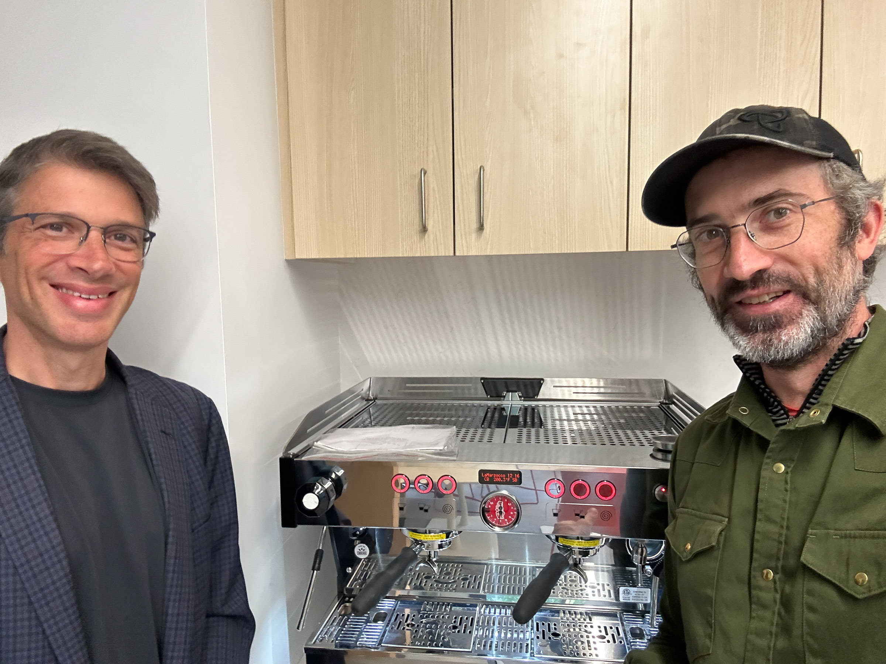

## Team

The lab is led by Professor Jeffrey Grossman and managed by Justin Lavallee. You can reach our entire team at [dmse-breakerspace@mit.edu](mailto:dmse-breakerspace@mit.edu).

___

### Robert Sansone

__Provides training for the following Instruments__:
 - Optical microscope
 - Scanning electron microscope (SEM)

___

### Carlos Anciano Martinez

Hola! I'm a sophomore in Course 3 _✨ material gworl ✨_

__Provides training for the following__:
 - Everything

___

### Syd Robinson

I'm a course 3-C junior!

__Provides training for the following__:
 - Optical microscope
 - SEM
 - XRD

___
