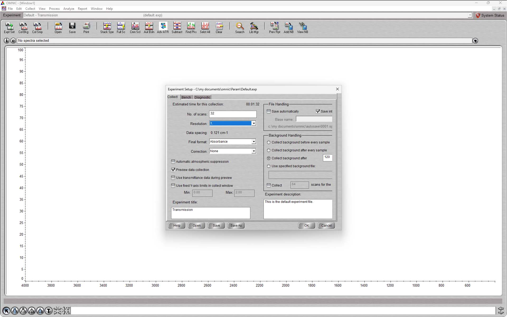
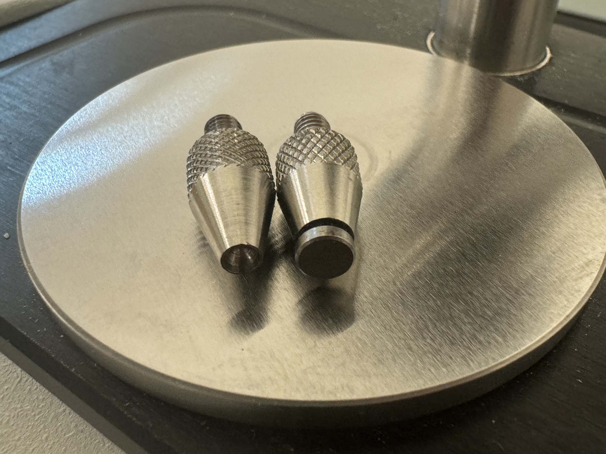

# Breakerspace FTIR Tutorial

## Overview:

The Nicolet iS5 Fourier-transform infrared (FTIR) spectrometer provides an infrared spectrum of absorption or transmission of a solid, liquid, or gas, for identification, primarily, of organic or polymeric materials. This tutorial focuses primarily on use of the instrument with an attenuated total reflectance (ATR) accessory, which allows for easy sampling of materials in solid, semi-solid, powder, paste, and liquid forms. The Breakerspace has an [iD7](https://knowledge1.thermofisher.com/Molecular_Spectroscopy/Molecular_Spectroscopy_Media_and_Document_Repository/Nicolet_Summit_and_Nicolet_Summit_PRO_User_Guide/Sampling_Accessories_for_the_Summit_Spectrometer) attenuated total reflectance (ATR) accessory that is left on the instrument by default, and also an [iD1](https://knowledge1.thermofisher.com/Molecular_Spectroscopy/Molecular_Spectroscopy_Media_and_Document_Repository/Nicolet_Summit_and_Nicolet_Summit_PRO_User_Guide/Sampling_Accessories_for_the_Summit_Spectrometer) transmission accessory and a [Pike Technologies EasiDiff](https://www.piketech.com/product/dr-easidiff-tm/) diffuse reflection accessory. 

### Index:

* [Standard operating protocol](#sop) - ([startup](#startup), [operation](#operation), [shutdown](#shutdown))
* [Materials and sample prep](#materials)
* [Detailed operating instructions](#details)
* [Data processing and analysis](#data)
* [Common failure modes](#failures)
* [Manufacturer manuals](#manuals)
* [Links](#links)
* [Exercises](#exercises)

### Standard operating protocol:

 
#### Instrument startup:

* [Power on instrument](../assets/img/tutorials/ftir/ftir-switch.JPG), [if needed](../assets/img/tutorials/ftir/ftir-power.JPG)
* Log on to instrument workstation using your MIT Kerberos
* [Start OMNIC software](../assets/img/tutorials/ftir/ftir-desktop.JPG)
* Verify instrument connection via [system status](../assets/img/tutorials/ftir/omnic-status.PNG)
* Remove protective cover from ATR crystal plate
* [Clean ATR crystal](#crystal)
* Collect background

 
#### Operation:

* [Clean ATR crystal](#crystal)
* Collect sample
* Save sample spectrum  

Repeat steps as needed

 
#### Instrument shut down:

* Save all data (each spectrum must be indvidually selected and saved)
* Close OMNIC
* Log off workstation
* Clean ATR crystal
* Put cover on crystal plate and clamp in place using pressure tower
* Do not switch off (the manufacturer recommends leaving the instrument powered when not in use)

 
### Compatible materials and sample prep: 

* Any non-hazardous solid, semi-solid, powder, paste, and liquid materials
* Solvents needed to clean a sample off the instrument must also be non-hazardous 
* Only sensitive to molecules that absorb IR radiation and transition to excited vibrational state
* Complementary information to Raman spectroscopy, often

##### _If you have any questions about whether a material is appropriate to characterize in the Breakerspace, please ask before bringing it to the lab._

 
### Detailed operating instructions: 

 
#### ATR Sample preparation and loading:

To maximize signal strength, it is important that the sample is in good contact with the entire ATR window. 

##### _Be sure to collect a background before loading samples_

#### Solid samples:

* Select self leveling [pressure tip](#pressure-tip)
* Solid samples should be smooth and free of contaminants on the face to be tested
* Cover the ATR crystal with the sample
* Position the pressure tower over the window
* Tighten the turn the knob until the clutch slips to provide clamping pressure to the sample 

Although many solid samples will not contaminate the window, it is still a good idea to wipe the window with isopropyl alcohol and a Kimwipe between samples.

<figure style="margin-left:0; margin-right:0;">
  
  <figcaption>Loading a solid sample</figcaption>
</figure>

#### Powder samples:

It is especially important that powders contact the surface of the diamond window as completely as possible, so it is helpful that they are ground as finely as possible. It is helpful to load powders in preview mode and verify the pressure tip is pushing the powder into intimate contact with the ATR crystal before collecting a spectrum.

* Either the concave or self-leveling [pressure tip](#pressure-tip) can work, try both to see if one is better with your sample
* using a spatula, place a small amount of powder sufficient to cover the ATR crystal 
* Position the pressure tower over the ATR crystal
* Tighten the turn the knob until the clutch slips

<figure style="margin-left:0; margin-right:0;">
  
  <figcaption>Loading a powder sample</figcaption>
</figure>

#### Liquid samples:

* Place droplet of sample on ATR crystal
* Non-volatile liquids can be run uncovered, without the use of the pressure tower
* Volatile samples can be covered with the [volatiles cover](#volatiles-cover) to prevent evaporation. Clamp volatiles cover with the pressure tower

<figure style="margin-left:0; margin-right:0;">
  
  <figcaption>Loading a non-volatile liquid sample</figcaption>
</figure>

 
#### Cleaning the ATR crystal:

* apply a few drops of isopropyl alcohol to a Kimwipe
* wipe with wetted portion of the Kimwipe, starting in the center and working outwards
* using a dry portion of the Kimwipe, or a new Kimewipe, dry the crystal and surrounding area

<figure style="margin-left:0; margin-right:0;">
  
  <figcaption>Cleaning the ATR crystal</figcaption>
</figure>

 
#### Experiment setup:

Experiment setup allows you to change the parameters to fit your requirements. For faster collections, reduce the number of scans and/or scan resolution, and note how the estimated time changes. To improve the signal to noise ratio, increase the number of scans.

There are two ways to collect a spectrum (either background or sample): with _preview_ on or off. If the _Preview data collection_ parameter is selected, the instrument will show a live spectrum that refreshes approximately every second during preview mode. Once you are satisfied with your sample setup, run the full scan by by clicking start collection in the upper right. Deselect _Preview data collection_ if you wish to bypass the preview stage and run your full scan immediately. This setting will apply to both background and sample collection.

For a [comprehensive explanation](../assets/img/tutorials/ftir/exp-set-help.JPG) of the parameters in experiment setup, select help in the lower left.

##### _Preview data collection_ enabled:

<figure style="margin-left:0; margin-right:0;">
  
  <figcaption>Background and sample collection with <i>Preview data collection</i> on</figcaption>
</figure>

<figure style="margin-left:0; margin-right:0;">
  
  <figcaption>Background and sample collection with <i>Preview data collection</i> on in the OMNIC software</figcaption>
</figure>

##### _Preview data collection_ not enabled:

<figure style="margin-left:0; margin-right:0;">
  
  <figcaption>Basic sample collection without preview data enabled</figcaption>
</figure>

 
#### Background collection:

Before collecting spectra, it is necessary to collect a background spectrum. 

>_A background spectrum is a single-beam spectrum obtained without a sample in place. The background spectrum is the result of the output of the source; the response of the beamsplitter, optics, sampling accessory or holder, and detector; and any atmospheric absorptions inside the spectrometer. A single-beam sample spectrum can be ratioed against the background spectrum to remove the effects of the background and produce a transmission spectrum._ ([Definition from the Thermo Scientific OMNIC Help Topics](../assets/img/tutorials/ftir/background-def.PNG))

* iD7 ATR accessory background collection is run with the cleaned diamond crystal exposed to air (no pressure clamp)
* iD1 transmission accessory background is run with no sample in the compartment
* EasiDiff diffuse reflectance background collection is run on a sample cup holding pure KBr powder
* set instrument up per above for your experiment and click "collect background" and continue through the collection process
* After background is collected you can choose to add it to the spectra window, or not. In both cases that background scan will automatically be used on subsequent sample collections.

##### _Negative absorbance in an ATR spectrum indicate the crystal was not clean during background collection._ 

 
#### Sample collection:

Once your background is collected you are ready to collect a spectrum for your sample. Load it according to the above instructions, and click collect sample, following the process based on your experiment setup. 

#### Volatiles cover:
<figure style="margin-left:0; margin-right:0;">
  
  <figcaption>Use of the volatile cover </figcaption>
</figure>

#### Pressure tips:

<figure style="margin-left:0; margin-right:0;">
  
  <figcaption>Concave (left) and self-leveling (right) pressure tips</figcaption>
</figure>

<figure style="margin-left:0; margin-right:0;">
  
  <figcaption>Swapping pressure tips</figcaption>
</figure>

 
### Data processing and analysis:

Data processing is beyond the scope of this tutorial, but we recommend the use of the [Wiley KnowItAll Spectroscopy Software & Libraries available through the MIT Libraries](https://libguides.mit.edu/knowitall).

### Common failure modes:

* ATR Signal to noise is low if sample is not in intimate contact with ATR crystal
* If instrument is connected into different USB port on workstation it will not connect
* Negative features in an ATR spectrum indicate the crystal was not clean during background collection

 
### Manufacturer's manuals:

* [iS5 spectrometer user guide](https://www.dropbox.com/scl/fi/rfba0x3swuhi4affsytv6/2638_iS5-UG.pdf?rlkey=mnjpwg72rbau8dsaw8jwg9flk&dl=0)
* [iD7 ATR User Guide](https://www.dropbox.com/scl/fi/j24msyzbfpqahhk66z5y8/3021_-iD7_UG.pdf?rlkey=xf1sw5yoydqomsmcs1hxhrf5y&dl=0)
* [OMNIC software _Getting Started_ guide](https://www.dropbox.com/scl/fi/nhx1fk2ov5fpkz4og1guf/2640_OMNIC_GS.pdf?rlkey=93wld38wdscvv94o177jylilu&dl=0)
* [Complete set of manufacturer's manuals](https://www.dropbox.com/scl/fo/n0zv4090ncohz1yd53zyp/AEk8_3vo2JuCcHDSDBEEjck?rlkey=haqbguq12kbmh8fi7jmi8wzvg&dl=0)

### Links:

* [Thermo Scientific FTIR sampling techniques](https://www.youtube.com/playlist?list=PLMiikclf3GL4ZAFqfux1tR1pyYmS4AkjR)
* [Pike Technologies tips of the week](https://www.piketech.com/tip-of-the-week/)

 
### Exercises:

Test solid polymer samples and determine which is acrylic and which is polypropylene through a library search. Measure samples of caffeinated and decaffeinated ground coffee and determine which is which by comparing the height of the peak at 1650.

