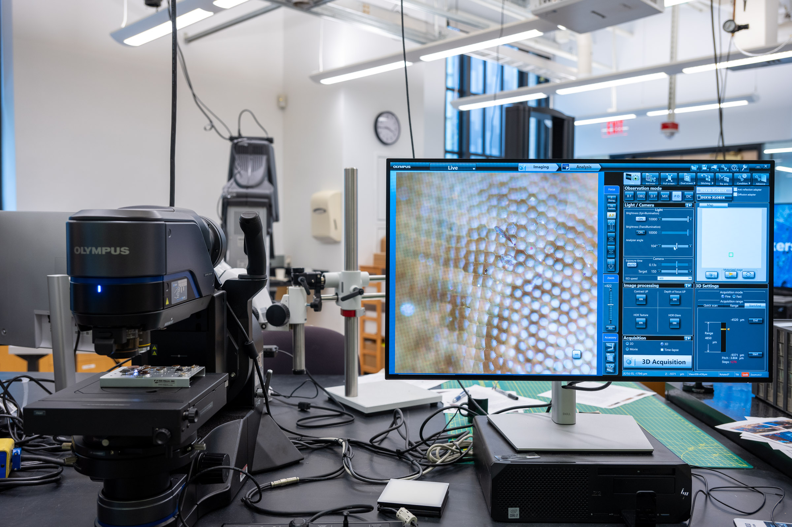
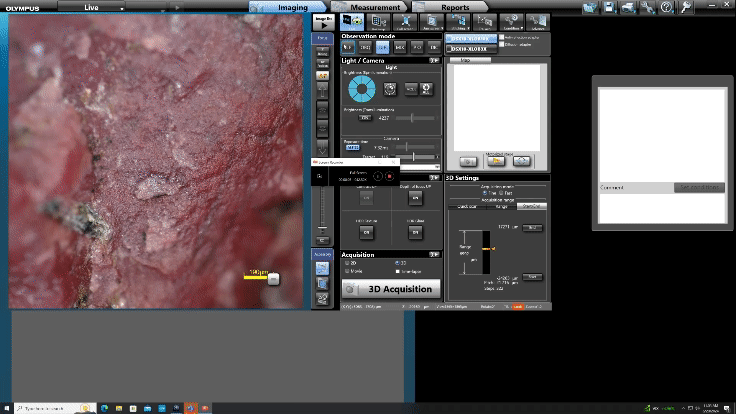
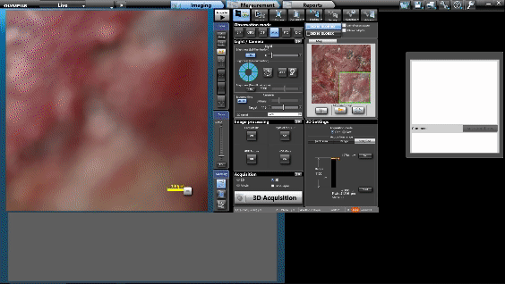
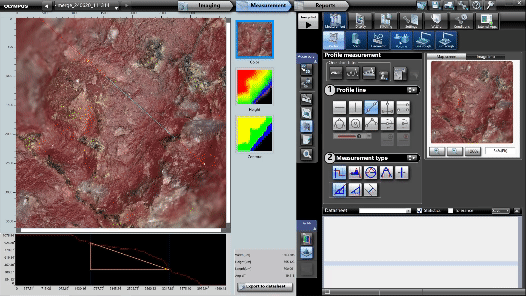

# Breakerspace Optical Microscope Tutorial

## Overview:

The Olympus DSX1000 Digital Microscope is a powerful instrument that allows you to see images in full color at high magnifications, capture 3D data, and stitch together large images with six observation modes.

### Index:

* [Standard operating protocol](#sop) - ([startup](#startup), [operation](#operation),[features](#features), [shutdown](#shutdown))
* [Materials and sample prep](#materials)
* [Detailed operating instructions](#details)
* [Data processing and analysis](#data)
* [Common failure modes](#failures)
* [Manufacturer manuals](#manuals)
* [Links](#links)
* [Exercises](#exercises)

### Standard operating protocol:

 
#### Instrument startup:

* [Switch](../assets/img/tutorials/optical/switch.JPG) the microscope [on](../assets/img/tutorials/optical/status-on.JPG)
* Log on to instrument workstation using your MIT Kerberos
* Clear the [stage](../assets/img/tutorials/optical/stage.JPG) of any samples or other materials
* Start the [DSX Software](../assets/img/tutorials/optical/desktop.PNG) and [log on as Guest](../assets/img/tutorials/optical/guest.PNG) (no password)
* [Acknowledge it is safe for the stage and head to move](../assets/img/tutorials/optical/acknowledge.PNG)
* Use the manual focusing knob to [lower the microscope stage](../assets/img/tutorials/optical/lower.GIF)
* Load/change [objectives](#objectives) if needed
* Lower the microscope head into the _tilt position_ using [the button on the console](../assets/img/tutorials/optical/tilt-console.JPG) or the [software button](../assets/img/tutorials/optical/tilt-software.JPG)

#### Operation: 

* [Put your sample on stage](#sample-prep)
* Use the [manual focusing knob](../assets/img/tutorials/optical/focus.GIF) to bring sample into focus
* With the [joystick move stage](../assets/img/tutorials/optical/joystick.GIF) back/forth and left/right to position desired sample area under observation
* Fine-tune focus by moving the zoom head with the console buttons/[wheel](../assets/img/tutorials/optical/focus-wheel.GIF) or software buttons
* Select observation mode by clicking the best image button, select all modes, select desired image, and click apply ([see manual page 63](https://www.dropbox.com/scl/fi/bmfph79975i1p0wv4pbuf/DSX1000-Application-M-E.pdf?rlkey=fzmbq39hr926gpbbtgft9fxxt&dl=0))
* Characterize! For a list of features see the [detailed operating instructions](#details)
* Verify files are saved where you intend
* Repeat as needed

#### Instrument shut down: 

* Close the DSX software
* Click [yes](../assets/img/tutorials/optical/exit.GIF) to exit the microscope system and retract the head
* Once the software fully closes, [switch](../assets/img/tutorials/optical/switch.JPG) the microscope [off](../assets/img/tutorials/optical/status-off.JPG)
* Log out of Windows
* Place the [dust cover](../assets/img/tutorials/optical/cover.JPG) on the microscope

 
### Compatible materials and sample prep: 

* Materials should be non-hazardous and safe to handle in the Breakerspace
* Any liquids should be contained so they do not spill on the [stage](../assets/img/tutorials/optical/stage.JPG)
* Loading capacity of the stage is 5 kg

 
#### Sample Prep:

The instrument has no particular sample prep requirements. As long as a sample is non-hazardous and safe to handle, weighs less than 5 kg, is not so tall as to prevent achieving focus, and can be place under observation without contaminating the microscope (ie spilling), it is possible to observe on the microscope. However, additional care in sample preparation (ie. careful slicing with a sharp blade) may improve imaging results, depending on sample material and characterization goals. 

 
### Detailed operating instructions:

#### Features:

* Quick preview of and switching between six observation modes (brightfield, oblique, darkfield, brightfield/darkfield mix, simple polarization, and differential interference contrast)
* Capture 2D and 3D images
* Automated capture and stitching of images in 2D or 3D mode to show larger regions
* Tilt the microscope head to observe your sample from different angles
* Rotatable stage
* Many post-processing and analysis tools to annotate images with dimensions, calculate surface roughness, export 3d mesh data, etc.

#### Objectives:

* Long working distance: 3x (cannot be used in polarized observation mode), 10x, 20x, 40x 
* Extra long working distance: 1x, 3x, 10x
* Instructions to replace objective unit are on page 11 of the [Quick Reference Guide](https://www.dropbox.com/scl/fi/npmn40ndidrc329ev1eze/DSX1000_QRG_EN_AX9342_03.pdf?rlkey=qwg423vnbo5o3811uyjbzhmlh&dl=0)

There is an internal optical zoom system that boosts magnification from 14-140x, so total magnification will be (external objective) * (internal zoom factor), for a range of about 14x to 5600x depending on configuration used.

#### Observation modes:

Many different observation modes are available and can be selected in the desktop application or on the console:

* Brightfield (BF) - recommended for observing flat samples
* Oblique - similar to the BF observation, recommended for emphasizing the scratches or unevenness
* Darkfield (DF) - recommended for finding edges, dust, or scratches, or for observing color that is difficult to observe in BF observation
* Brightfield/darkfield mix - combines easy visibility in BF observation and high detectability in DF observation, recommended for searching scratches or defects that are difficult to find
* Simple polarization - recommended for finding the best image of the sample, e.g., crystals of rocks or minerals, etc.
* Differential interference contrast (DIC) - recommended for observing fine unevenness (wave) that cannot be found with other observation methods

The _Best Image_ feature gives a quick preview of how the sample looks in each observation mode, and allows quick selection of the preferred mode. The [DSX1000 Digital Microscope Operation Manual](https://www.dropbox.com/scl/fi/bmfph79975i1p0wv4pbuf/DSX1000-Application-M-E.pdf?rlkey=fzmbq39hr926gpbbtgft9fxxt&dl=0) offers detailed instructions on use of the _Best Image_ feature on page 52, and detailed explanations of each observation mode starting on page 63.

<figure style="margin-left:0; margin-right:0;">
  
  <figcaption>Using the <i>Best Image</i> feature to choose an observation mode</figcaption>
</figure>

#### Acquisition:

The microscope is able to acquire and save images in 2D or 3D, and can capture and automatically stitch images together to create higher resolution images or cover a larger area on the sample than can be observed at one time.

#### 2D:

A 2D acquisition will save an image of whatever is displayed in the live view. A detailed walkthrough of the 2D acquitision process can be found starting on [page 106 of the manual](https://www.dropbox.com/scl/fi/bmfph79975i1p0wv4pbuf/DSX1000-Application-M-E.pdf?rlkey=fzmbq39hr926gpbbtgft9fxxt&dl=0).

#### 3D:

a 3D acquisition will capture a series of images, changing the focal plane slightly between each. It will composite the sharpest pixels from each source image into a final 3D image where the entire area under observation appears in focus. It will also capture height data, which can be exported as a [.stl file](https://en.wikipedia.org/wiki/STL_(file_format).

There are various methods available to set the start and stop heights, and step size, of 3D image captures. A detailed description of various options begines on [page 112 of the manual](https://www.dropbox.com/scl/fi/bmfph79975i1p0wv4pbuf/DSX1000-Application-M-E.pdf?rlkey=fzmbq39hr926gpbbtgft9fxxt&dl=0).

#### Stitching:

Stitching allows you to capture images in 2D or 3D with a wide field of view/high resolution by capturing multiple frames while the stage travels. Further information about the stitching process can be found on [page 132 of the manual](https://www.dropbox.com/scl/fi/bmfph79975i1p0wv4pbuf/DSX1000-Application-M-E.pdf?rlkey=fzmbq39hr926gpbbtgft9fxxt&dl=0).

#### Other acquisition methods:

The DSX application is also capable of capturing timelapses, movies, and acquiring images along a path. The full set of options are all detailed in chapter 9 of the application manual, beginning on page 106.

### Data processing and analysis 

The measurement feature allows the user to determine a variety of information about the sample. This includes the change in elevation, horizontal distance, and angle between two points or along a shape. The volume of the sample can be calculated, along with the volumes of any divots or troughs along the sample. To perform these measurements, click on the measurement tab next to imaging, and then click the measurement option located directly below the reports tab. To check the distance, change in elevation, or angle between two points, select the profile option. To make a wire frame model, click the button with the arrow pointing from 2D to 3D. To find the volume of a crest or trough, select the volume option.

<figure>
	 
	
</figure>

### Common failure modes

* If the software is started before the microscope is switched on, you will see an [error message](../assets/img/tutorials/optical/control-error.PNG) and the connection will [fail](../assets/img/tutorials/optical/unable-start.PNG)
* If any part of your sample is resting on a part of the stage that cannot move, as you move the stage your sample will rotate on the stage.

### Manufacturer's manuals 

* [DSX Quick Reference Guide](https://www.dropbox.com/scl/fi/npmn40ndidrc329ev1eze/DSX1000_QRG_EN_AX9342_03.pdf?rlkey=qwg423vnbo5o3811uyjbzhmlh&dl=0)
* [DSX Application Manual](https://www.dropbox.com/scl/fi/bmfph79975i1p0wv4pbuf/DSX1000-Application-M-E.pdf?rlkey=fzmbq39hr926gpbbtgft9fxxt&dl=0)
* [Hardware manual](https://www.dropbox.com/scl/fi/xg225i22sji3ap6mbdxxb/DSX1000_HardwareManual_EN_AX9336_07.pdf?rlkey=t9ndinow4wd8wwt9l1mlmtzzl&dl=0)
* All docuemntation can be found [here](https://www.dropbox.com/scl/fo/lpmj7kw7kjfzrwzpy3s31/AHTufXDD4RDfEImJssdaxjc?rlkey=t1rl3ywuxnde1129767txmfgw&dl=0)

### Links

* list of links, ie. good video tutorials, some student project, anything relevant

### Exercises

* intro for anyone - eg honey bee on optical
* beginner exercise for course 3 subjects - identify and measure types of grain in metal sample, 
* advanced exercise - deconvolution of compound sample from spectrometer, etc.

