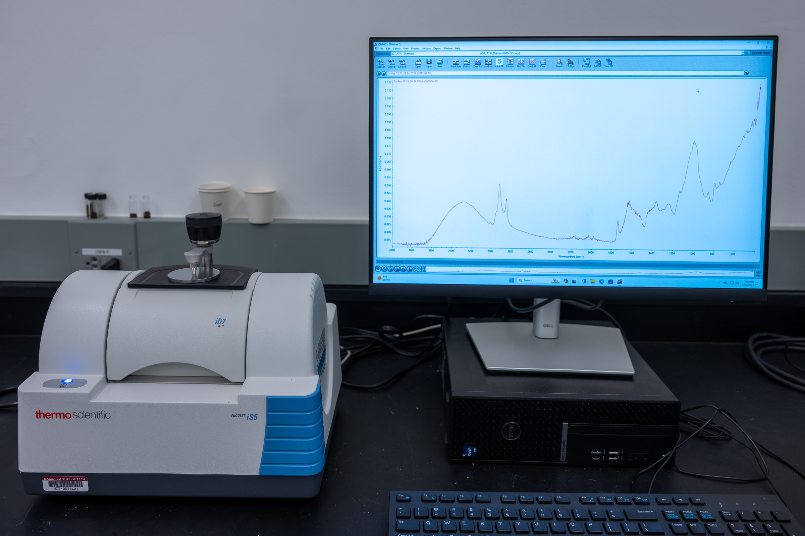

# Index of tutorials while in development:

[FTIR](./ftir.html)  
[instron-tester](./instron-tester.html)  
[optical](./optical.html)  
[particle size analyzer](./psa.html)  
[SEM](./sem.html)  
[uv-vis](./uv-vis.html)  
[XRD](./xrd.html)  

[sample library](../sample-library.html)

# Breakerspace Instrument Tutorial Template

## Overview:

Matches info/image for instrument on lab page, brief description of what it does/how it works/what materials it's used for

### Index:

* [Standard operating protocol](#sop) - ([startup](#startup), [operation](#operation), [shutdown](#shutdown))
* [Materials and sample prep](#materials)
* [Detailed operating instructions](#details)
* [Data processing and analysis](#data)
* [Common failure modes](#failures)
* [Manufacturer manuals](#manuals)
* [Links](#links)
* [Exercises](#exercises)

### Standard operating protocol:

 
#### Instrument startup:

* sequence of powering on, logging in, starting softare, homing/tilt position etc.
* these steps should only need to be completed once per session
* no images on page in this section, just text bullets, [text can link to image if needed](../assets/img/tutorials/template/ftir-switch.JPG)

#### Operation: 

* steps to characterize - sample loading, data capture and saving, etc. - whatever might be repeated, characterization sequence
* for instruments like SEM with multiple, independent characterization techniques (eg. EDS, imaging), make technique a top-level bullet and indent for steps
	* this is tabbed in to be a sub-set of the above bullet

####  Instrument shut down:

* sequence to close/log off/power down as needed - whatever is done once at the conclusion of a session
* highlight important steps in bold (ie. __make sure UV-Vis lamp is OFF__)
* these steps should need to be performed once at the end of a characterization session

 
### Compatible materials and sample prep: 

* compatible materials
* incompatible materials
* safety/handling related info
* images/videos inline as needed

#### Sample Prep may be own sub-section:

* sample prep
	* break into sub-sections as relevant, 
	* ie. solid vs. powder vs. liquid

 
### Detailed operating instructions: 

* include sample loading/unloading
* as needed explanations of each step, eg. collecting background, sample loading, etc.
* software features
* images/videos inline as needed

### Data processing and analysis:

* what softare we recommend
* typical steps
* fill in with more detail as time allows, and/or add standalone data processing tutorials
* images/videos inline as needed

### Common failure modes:

* these are where people frequently get stuck
* example may include starting DSX software before microscope powered up
* images/videos inline as needed

### Manufacturer's manuals:

* Links to manual files in dropbox

### Links:

* list of links, ie. good video tutorials, some student project, anything relevant

### Exercises:

* intro for anyone - eg honey bee on optical
* beginner exercise for course 3 subjects - identify and measure types of grain in metal sample, 
* advanced exercise - deconvolution of compound sample from spectrometer, etc.

# HTML examples to control layout, etc.

Full width image , with caption, link to open image full screen:  

<figure style="margin-left:0; margin-right:0;">
	
	<figcaption> The FTIR power switch. </figcaption>
</figure>  

33% width images using html image tags, one links to full screen:

<figure style="margin-left:0; margin-right:0;">
	 
	
	
	<figcaption> Raman microscope, FTIR spectrometer, and scanning electron microscope. </figcaption>
</figure>

An image that floats to the right of text:

 FLOAT RIGHT - Floating image with text. 

This tag is necessary to clear the float, or else all text below will keep floating next to image: \

  

Same thing with image that floats to the left of text:  

 FLOAT LEFT - Floating image with text. Floating image with text.Floating image with text.Floating image with text.Floating image with text.Floating image with text.Floating image with text.Floating image with text.Floating image with text.Floating image with text.Floating image with text.Floating image with text.Floating image with text.Floating image with text.Floating image with text.Floating image with text.Floating image with text.Floating image with text.  

  

A gif sized to 32% width, that autoplays, with link that opens it full size:

<figure style="margin-left:0; margin-right:0;">
  
  <figcaption> Loading a solid sample</figcaption>
</figure>

A full width, high resolution gif:

<figure style="margin-left:0; margin-right:0;">
  
  <figcaption> A higher resolution gif</figcaption>
</figure>

An optimized embedded gif that links to a high resolution gif:

<figure style="margin-left:0; margin-right:0;">
  
  <figcaption> A 750px wide gif that opens at higher resolution</figcaption>
</figure>
  
Embedded video with controls:

<video width="100%" controls>
  <source src="../assets/video/raman-display-flip.MOV" type="video/mp4">
Your browser does not support the video tag.
</video>

