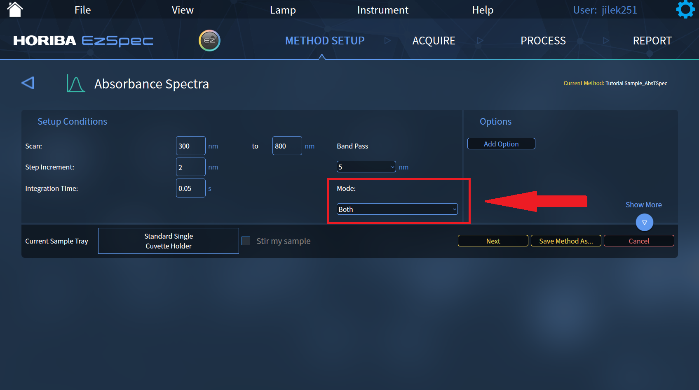
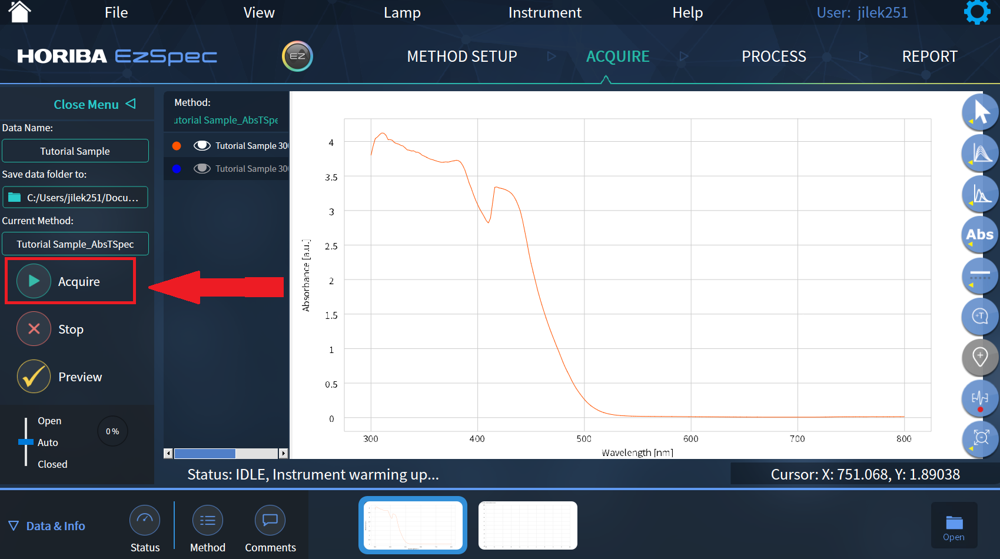
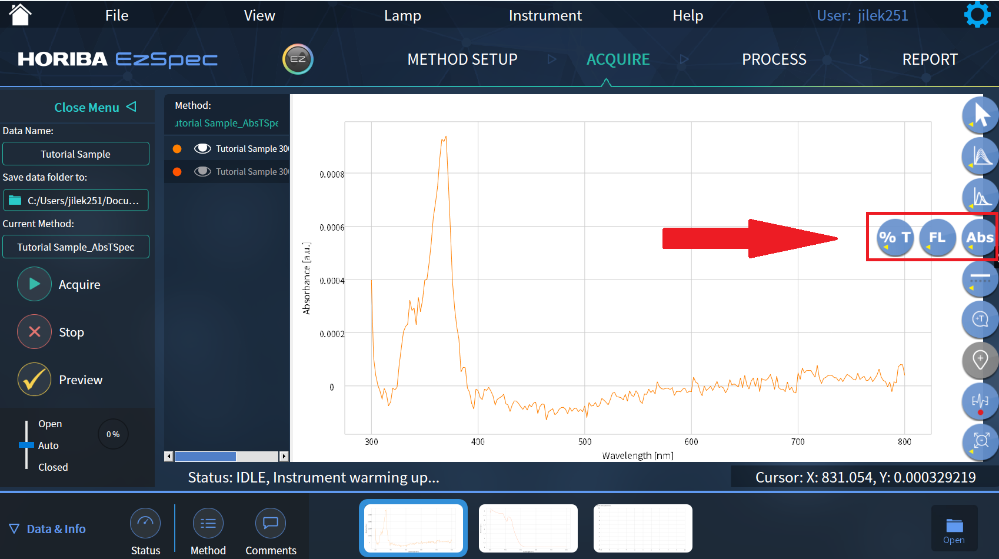

# Breakerspace Instrument Tutorial Template updated

## Overview

Matches info/image for instrument on lab page

### Standard Operating Protocol:

* Start Up
    * Flip power switch and press power button. 
    * Power button must be blue to operate
    * Log on to the desktop
    * Open the EzSpec software
    * Click EzSpec button
* Operation
    * Click new method
    * Click absorbance and transmission. There are other modes, but users are primarily focused on this mode.
    * Click spectra
    * Make sure the setup conditions are adequate.
    * Set mode to both

<figure>
	
	<figcaption>  </figcaption>
</figure>

    * Fill the cuvet with your sample
    * Name your sample and choose where you want it to save
    * Click acquire 

<figure>
	
	<figcaption>  </figcaption>
</figure>

    * Load your sample and close the top
    * Load a sample of deionized water when the software instructs you to load a blank
    * Toggle between absorption and transmission spectra in the menus on the right

<figure>
	
	<figcaption>  </figcaption>
</figure>
